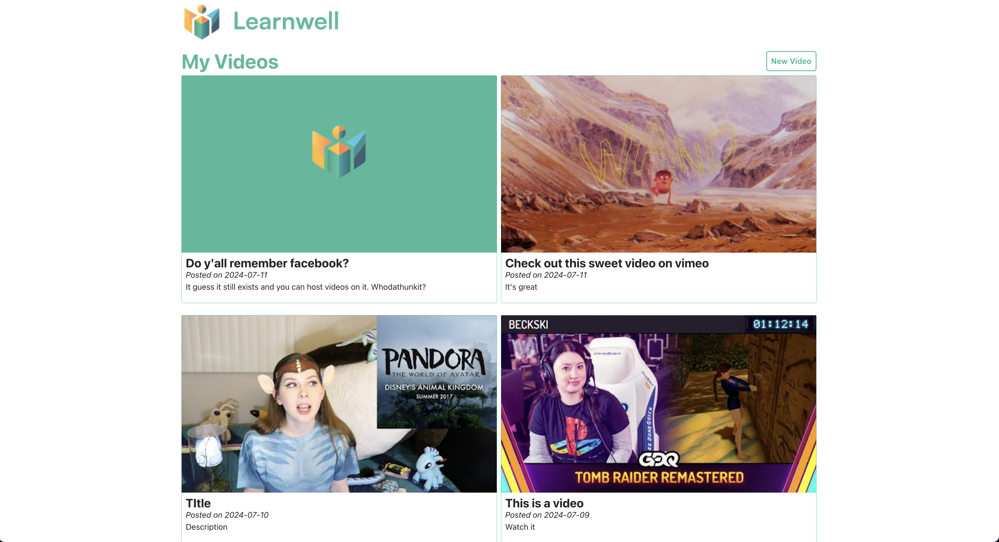
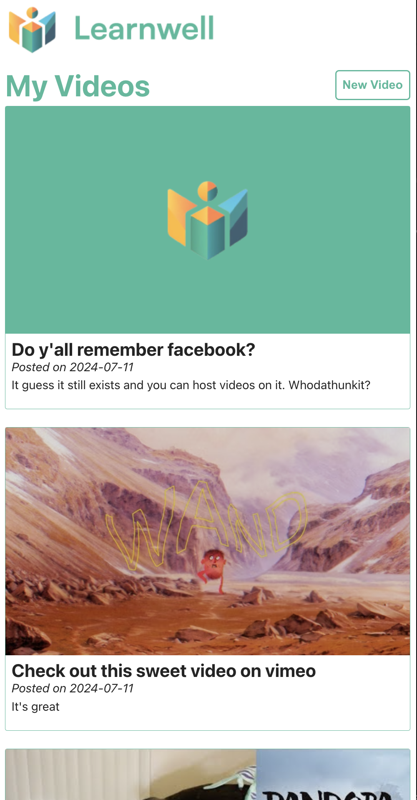
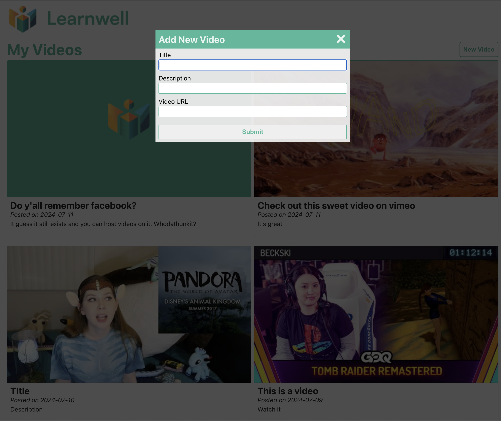
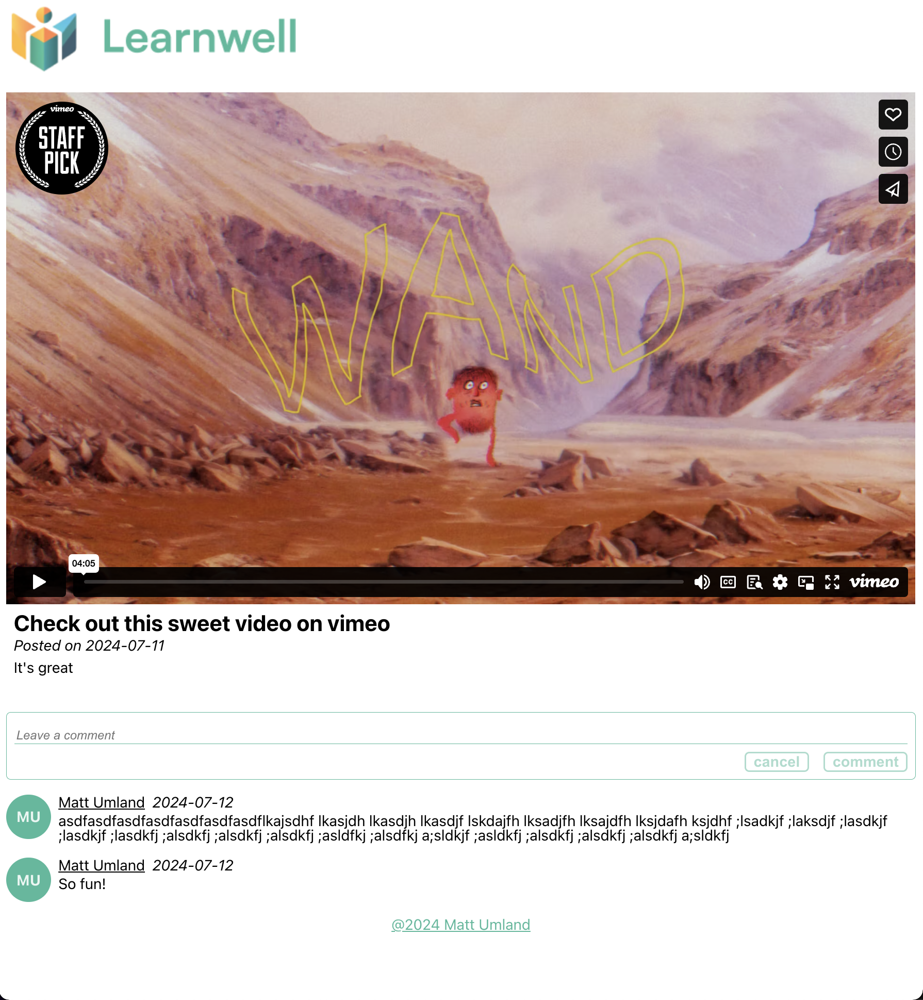

# Learnwell
A simple app built as a take-home assessment. Here's the brief...

## Overview

``You are a software engineer, and have been hired by an EdTech company to develop a simple web application that allows users to create, comment on, and watch educational videos. The application should interact with the given backend API and provide a seamless and engaging experience for users. The design and UI are up to you to create.``

API: https://take-home-assessment-423502.uc.r.appspot.com/docs

App Functionality: The website must have the following capabilities:
- Show a list of videos and allow users to select a video from the list.
- Allow the user to create a new video object with a title, description and a video URL.
- A user must be able to comment on a video and view comments from other users.
- Open the videos in full screen with full playback functionality.
- Include options for adjusting playback speed and volume.

## Tech stack
- [JavaScript](https://developer.mozilla.org/en-US/docs/Web/JavaScript)
- [React](https://react.dev/)
- [Styled Components](https://styled-components.com/)
- [ReactPlayer](https://www.npmjs.com/package/react-player)
- [Vite](https://vitejs.dev/)

## Installation
1. Clone the repo at https://github.com/mattumland/video-site
2.

## Design
#### Data
The simple nature of the app made prop drilling a viable option for moving data around. The user name is passed down the tree via Context API since that is a standard place to store authentication data.

The single video page needs takes advantage of the React Routers data routers to fetch the video and comment data. Special care is taken to only refetch/rerender comment data when a user adds a comment.

#### Router
React Router allows each video to have a unique page. This gives users the option to easily share videos using urls while keeping the project a Single Page App.

#### Forms
The new video form uses the FormData API, which removes the need for a local state to control the form. The comment section uses local state to allow for a more dynamic UI that clears the form on cancel/submission and deactivates the buttons when the input is blank.

#### React Player
The app uses ReactPlayer, a popular and well maintained library that works with a wide variety of video hosting sites. The main video list page uses the players `light` mode, which removes the UI that is embedded along with the player. This is to improve the tab performance, which can get very cluttered when more than one video is displayed on the list. The outcome is a cleaner UX, which separates the app's interactions into two categories:

1. **Video collection interactions** (viewing the collection and uploading new videos) happen on the main index page.
2. **Individual video interactions** (watching a video, copying the link for sharing, reading/adding comments, reading the description) happen on the individual video pages.

While this is solid UI/UX choice it does come with one limitation. The `light` mode player uses [Noembed](https://noembed.com/) to fetch thumbnails, which is not supported by Facebook, Wistia and Mixcloud. In those cases, a fallback thumbnail that features the Learnwell icon is displayed instead.

#### Styled Components
Styled components allow for more dynamic styles that utilize javascript data to alter the rendering of components in different situations, such as the `Card Footer` being used for both the `Video Card` and `Single Video` components.

## Screenshots
Index page, desktop

Index page, mobile

New video form modal

Individual video page, desktop

Individual video page, mobile

## Testing
To test the app, you can either install it locally on your machine or